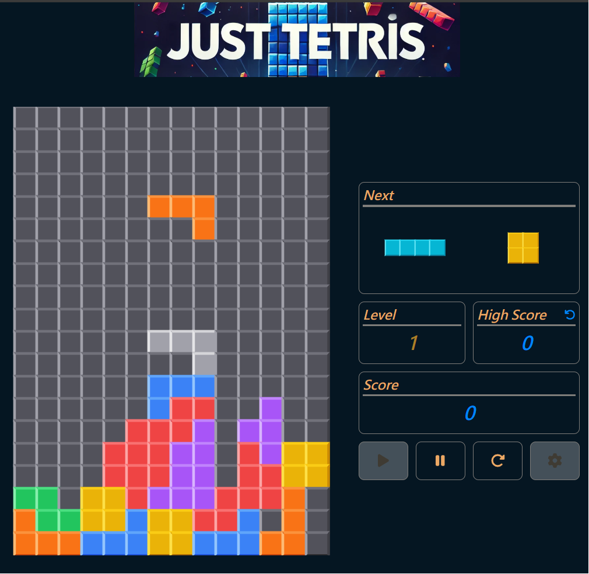

# 🎮 Just Tetris - Classic Fun, Reimagined! 🧩

**"Stack ‘em up!"**

Welcome to **Just Tetris**, a sleek and modern take on the timeless Tetris game! With innovative gameplay mechanics, customizable features, silky smooth controls, and a polished user interface, **Just Tetris** is designed to bring endless entertainment whether you’re a casual player or a high-score chaser. Built to be lightweight, fast, and engaging, this game redefines the classic Tetris experience while retaining its nostalgic charm.

---

### 🛠️ Tech Stack

- **[React.js](https://react.dev/)**: Dynamic and component-driven game interface.
- **[TypeScript](https://www.typescriptlang.org/)**: Strongly typed for robust and maintainable code.
- **[TailwindCSS](https://tailwindcss.com/)**: Clean, responsive, and customizable UI design.
- **[Vite](https://vitejs.dev/)**: Lightning-fast development and build tooling.
- **Quality Control**: **[ESLint](https://eslint.org/)** + **[Prettier](https://prettier.io/)** for consistent code quality, **[Husky](https://github.com/typicode/husky)** + **[lint-staged](https://github.com/okonet/lint-staged)** for pre-commit hooks.
- **Testing**: **[Vitest](https://github.com/vitest-dev/vitest)**, **[React Testing Library](https://testing-library.com/react)** for reliable test coverage.

---

### 📷 Screenshot

---

### 🎨 Features

- **🧩 Customizable Gameplay**: Adjust the board width and height to create your ideal playing field and choose difficulty levels that match your skills—from beginner to expert.
- **📱 Touch Control Optimization**: Experience seamless, responsive controls specially fine-tuned for mobile devices, ensuring intuitive block movement and rotation.
- **💾 Saved Settings and High Scores**: Never lose your progress—your game preferences and top scores are saved automatically, ready for your next session.
- **📐 Responsive Design**: The game board dynamically adjusts to screen size, maintaining a clean and optimized layout on desktops, tablets, and mobile devices alike.
- **🌐 Progressive Web App (PWA)**: Play instantly from any browser and install the app on your device for offline access and a native-like experience.

---

### 🌐 PWA Ready - Install & Play Anywhere!

- **Just Tetris** is designed as a Progressive Web App (PWA), bringing you the following benefits:
    - **Offline Support**: Keep playing even without internet connectivity.
    - **Installable**: Add it to your home screen for quick access, just like a native app.

---

### 🚀 Coming Soon

- **Real-Time Online Multiplayer**: Challenge friends and players worldwide with live matchmaking.
- **Global Scoreboard**: Compete for the top spot and track your rankings in real time.

---

### 👨‍💻 Contributing

Contributions are welcome! Fork the repo, submit your pull requests, and help us enhance the Just Tetris experience. Let’s stack blocks and build something amazing together!

---

### 📜 License

This project is licensed under the MIT License. See the [LICENSE.md](LICENSE.md) file for more details.

---

Relive the magic of Tetris with **Just Tetris**. Start playing today and stack your way to victory! 🎉
